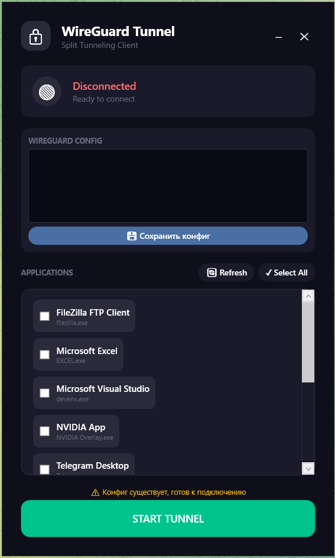

# WireGuard Tunnel

[](https://opensource.org/licenses/MIT)
[](https://github.com/fsystem88/WireGuardTunnel/releases)
[](https://github.com/fsystem88/WireGuardTunnel/releases)

A modern Windows GUI application for WireGuard with split tunneling support. Built with WPF and sing-box core.



## ✨ Features

- **Split Tunneling** - Select which applications go through VPN
- **WireGuard Support** - Use any standard WireGuard configuration
- **Modern UI** - Clean, dark-themed interface
- **System Tray** - Minimizes to tray when closed
- **Auto-detection** - Automatically detects running applications with windows
- **Real-time Status** - Live connection status monitoring
- **Portable** - Single executable with embedded sing-box core

## 🚀 Download

Get the latest version from the [Releases](https://github.com/fsystem88/WireGuardTunnel/releases) page.

### System Requirements
- Windows 10/11 (64-bit)
- .NET 6.0 or higher
- Administrator privileges (for TUN interface creation)

## 📖 How to Use

1. **Launch the application** (Run as Administrator)
2. **Paste your WireGuard configuration** in the text area:
   ```
   [Interface]
   PrivateKey = ...
   Address = ...
   DNS = ...
   
   [Peer]
   PublicKey = ...
   Endpoint = ...
   AllowedIPs = ...
   ```
3. **Click "Save Config"** to save your configuration
4. **Select applications** you want to route through VPN
5. **Click "START TUNNEL"** to establish connection
6. The app will show connection status:
   - 🔴 Disconnected
   - 🟡 Connecting...
   - 🟢 Connected

## 🛠️ Building from Source

### Prerequisites
- Visual Studio 2022 or later
- .NET 6.0 SDK
- Inno Setup (for installer)

## 📦 Included Components

- **sing-box v1.10.0** - Embedded proxy core
- **.NET Runtime** - Self-contained deployment

## 🔧 Configuration File Format

The application accepts standard WireGuard configuration format:

```ini
[Interface]
PrivateKey = YOUR_PRIVATE_KEY
Address = 10.0.0.2/32
DNS = 1.1.1.1, 8.8.8.8

[Peer]
PublicKey = PEER_PUBLIC_KEY
Endpoint = your-server.com:51820
AllowedIPs = 0.0.0.0/0, ::/0
```

## ⚙️ How It Works

1. User provides WireGuard configuration
2. App parses config and generates sing-box JSON configuration
3. sing-box creates TUN interface and routes selected applications
4. Status is monitored via IP check (api.ipify.org)
5. All other traffic goes direct (split tunneling)

## 🤝 Contributing

Contributions are welcome! Feel free to:
- Report bugs
- Suggest features
- Submit pull requests

## 📝 License

This project is licensed under the MIT License - see the [LICENSE](LICENSE) file for details.

## ⚠️ Disclaimer

This tool is for educational purposes. Users are responsible for complying with their local laws and regulations regarding VPN usage.

## 🙏 Credits

- [sing-box](https://github.com/SagerNet/sing-box) - Universal proxy platform
- [WireGuard](https://www.wireguard.com/) - Fast, modern VPN tunnel

## 📧 Contact

- GitHub: [@fsystem88](https://github.com/fsystem88)
- Issues: [GitHub Issues](https://github.com/fsystem88/WireGuardTunnel/issues)

---


**Made with ❤️ by fsystem88**
